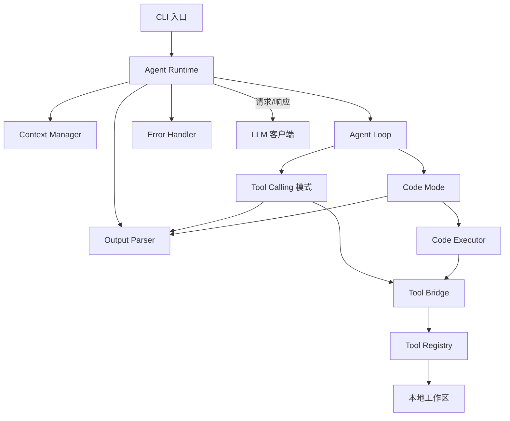

# 编程智能体架构设计

项目名称：programmatic-coding-agent
定位：软件工程专业推免项目（构建编程智能体）
文档状态：初步整体架构，含当前确定的决策与少量待定决策条目

## 一、项目定位

从零实现一个 Coding Agent：与大语言模型交互，自主读写文件、执行命令，完成编程任务。

在满足题目基本要求的基础上，以 Code Mode（Programmatic Tool Use）作为核心探索方向：模型不再逐次发起工具调用，而是生成一段 TypeScript Agent Program，由本地 Code Executor 整体执行这段程序，程序内部通过统一的工具接口完成文件读写与命令执行。

两种执行模式（Tool Calling 与 Code Mode）共用同一套工具实现与任务集，构成对照实验，测量两种模式在编程任务上的表现差异。

## 二、范围界定

当前范围（必须完整实现）：

- Coding Agent 基础循环：对话历史管理、模型交互、输出解析、循环终止、错误处理
- Tool Calling 模式：利用模型原生 tool calling 接口执行统一工具集
- Code Mode：模型生成 Agent Program，本地执行器运行
- 统一工具集：read_file、write_file、shell、glob
- 对照实验与指标采集
- CLI 交互入口与 benchmark 子命令

扩展方向（不进入当前范围，架构中预留扩展点）：

- Adaptive Mode：根据任务属性自动选择执行模式
- 更多工具：补丁应用、全文搜索等
- 多模型自由切换

## 三、总体架构



## 四、模块职责

### CLI

- 接收用户任务文本
- 参数：--mode（tool 或 code）、--max-rounds、模型配置、benchmark 子命令
- 展示执行过程与最终结果

### Agent Runtime

- Context Manager：维护消息历史（system、user、assistant、工具结果），对过长输出执行截断
- Agent Loop：主循环，负责调用模型、解析输出、执行动作、判断终止
- Output Parser：按当前模式解析模型响应
- Error Handler：将执行错误与异常格式化为结构化反馈并回填对话

### 两种模式

Tool Calling 模式解析模型响应中的工具调用，逐次经 Tool Bridge 执行，结果回填。

Code Mode 从模型响应中提取 Agent Program，整体交给 Code Executor，执行结果回填。

### Code Executor

- 代码提取：从模型全文提取代码块
- 前置校验：代码块语言标记、基础语法检查
- API 注入：向程序运行环境注入统一工具接口
- 执行：运行 Agent Program
- 输出捕获：标准输出、标准错误、注入 API 的调用记录
- 超时控制：单次执行超时上限
- 错误序列化：异常、退出码、堆栈转为结构化结果

### Tool Bridge 与 Tool Registry

- Tool Registry：集中登记工具名、参数描述、实现
- Tool Bridge：Tool Calling 模式下工具调用的执行入口；Code Mode 下注入程序的 API 函数内部同样调用这里的同一套实现

### 工具实现

- read_file(path)：读取文本文件
- write_file(path, content)：写入文件
- shell(command)：执行 shell 命令，返回输出与退出码
- glob(pattern)：返回匹配路径列表

### LLM 客户端

- OpenAI 兼容 HTTP 接口，base URL 与 API key 从环境变量读取
- Tool Calling 模式使用模型原生 tool calling 参数
- 记录每次调用的 token 用量与耗时，供指标采集

## 五、运行流程

### Tool Calling 模式

1. 用户任务进入 Context Manager
2. Agent Loop 请求模型（携带工具定义）
3. 响应含工具调用时，逐次执行，结果回填，回到第 2 步
4. 响应不含工具调用时，视为最终回复，循环终止

### Code Mode

1. 用户任务进入 Context Manager
2. Agent Loop 请求模型
3. 响应含代码块时，Code Executor 整体执行，结果回填，回到第 2 步
4. 响应不含代码块时，视为最终回复，循环终止

两种模式的差异仅在动作表达方式：逐次工具调用与整体程序执行。模型交互、上下文管理、终止判定、错误回填均为同一套实现。

## 六、Agent Program 与工具接口

Agent Program 形态示例：

```typescript
const files = await glob("src/**/*.ts");

for (const file of files) {
    const content = await read_file(file);

    if (content.includes("TODO")) {
        await write_file(file, content.replace("TODO", ""));
    }
}

await shell("npm test");
```

程序内可用接口与 Tool Registry 一一对应，参数与返回值语义一致。

执行结果回填格式（结构化）：

```text
程序执行完成
标准输出：...
标准错误：...
工具调用记录：read_file("a.ts") → 1234 字符；write_file("a.ts") → 完成
退出码：0
耗时：...
```

## 七、终止条件与错误处理

终止条件：

- 模型输出最终回复（不含工具调用或代码块）
- 达到最大轮次上限（可配置）
- 整体超时

错误处理：

- 工具执行失败：错误信息回填，模型继续修复
- 程序执行异常：堆栈与行号回填，模型修改程序后重试
- 连续失败达到上限：终止并报告

## 八、对照实验设计

控制变量：模型、任务集、工具集、工作目录、循环上限
自变量：执行模式（Tool Calling / Code Mode）
测量指标：

- 模型调用次数
- 工具执行次数
- token 用量（输入与输出）
- 端到端耗时与模型 API 耗时
- 任务成功率
- 错误恢复次数（失败后的重新尝试次数）

任务集：多个真实编程任务，每个任务带验收条件（文件内容断言、测试通过、命令输出断言）。任务覆盖单文件修改、批量修改、测试修复、脚手架生成等类型。

结果输出：每次运行输出结构化 JSON，汇总为对比报告。两种模式的系统提示词必然不同，此差异属于模式定义本身，实验中保持各自提示词稳定。

## 九、技术选型

- 宿主语言与运行时：TypeScript 与 Node.js
- Agent Program 语言：TypeScript，经 Node.js 的类型剥离支持直接运行
- LLM 接入：OpenAI 兼容 HTTP 接口
- 依赖策略：不使用任何 agent 框架或 SDK；模型交互走 HTTP 接口；glob 使用成熟轻量库；其余工具用 Node 内置能力实现

## 十、目录结构

```text
programmatic-coding-agent/
├── src/
│   ├── cli/
│   │   ├── index.ts
│   │   └── args.ts
│   ├── agent/
│   │   ├── agent-loop.ts
│   │   ├── context-manager.ts
│   │   ├── output-parser.ts
│   │   └── error-handler.ts
│   ├── modes/
│   │   ├── tool-mode.ts
│   │   └── code-mode.ts
│   ├── executor/
│   │   ├── code-extractor.ts
│   │   ├── code-executor.ts
│   │   └── execution-result.ts
│   ├── tools/
│   │   ├── tool-registry.ts
│   │   ├── tool-bridge.ts
│   │   ├── read-file.ts
│   │   ├── write-file.ts
│   │   ├── shell.ts
│   │   └── glob.ts
│   ├── llm/
│   │   ├── client.ts
│   │   └── types.ts
│   └── benchmark/
│       ├── task.ts
│       ├── runner.ts
│       ├── metrics.ts
│       └── report.ts
├── benchmark/
│   └── tasks/
├── docs/
│   └── architecture.md
├── package.json
├── tsconfig.json
└── README.md
```

## 十一、待定决策

以下条目不阻塞当前架构，细化设计时再定：

- Code Executor 的执行环境隔离方案：注入 API 的边界控制方式
- 两种模式系统提示词的具体内容与差异
- 参考项目调研：Cloudflare Code Mode、TanStack AI Code Mode、MCP Code Mode，确认后补充借鉴点
- Agent Program 语言细节：类型剥离的运行方式与兼容范围